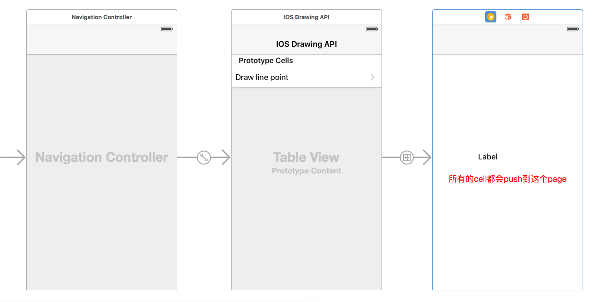
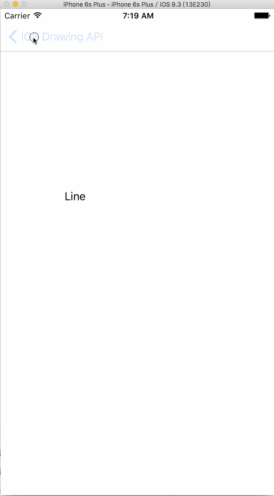

# Draw API的使用和页面跳转上一点点的优化

####参看别人的做的， 但是那个博客中是通过静态cell，和viewcontroller进行连接的， 也就是一个cell 会connect 到一个storyboard中拖入的viewcontroller， 对于我这种内存恐惧症还是有蛮大的伤害的， 所以我自己改了改，新手、勿喷！

- storyboard 中是这样的

- 运行成功后是这样子嘀

|  || |
| -- | -- | -- |