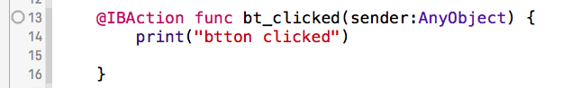

# Event Binding to UI action

绑定event到类成员函数；

- step 01： 在storyboard ui控件对应的UIcontroller类中新建 处理函数，并将函数通过@IBAction 标示；
  
  > 

- step 2:
  -  右击UI控件在Send envent选项中将相应地event事件拖拽到对应的ViewController上， 在弹出的函数选择框上选择需要绑定的函数； 
  - 另外一个办法就是在相应的viewcontroller上右侧工具栏中选择connections inspects